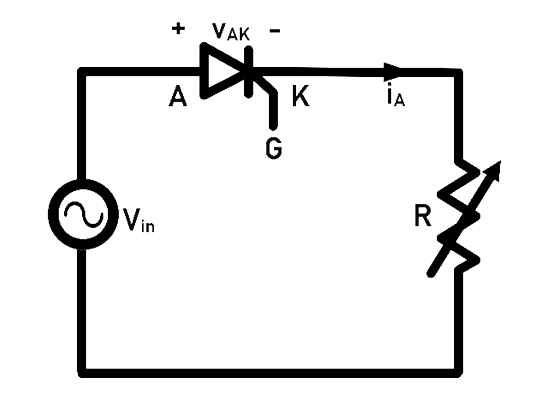
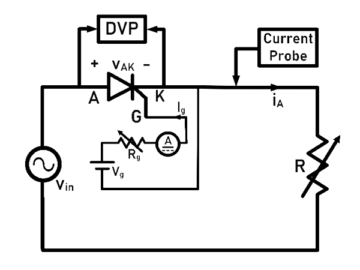
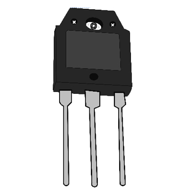
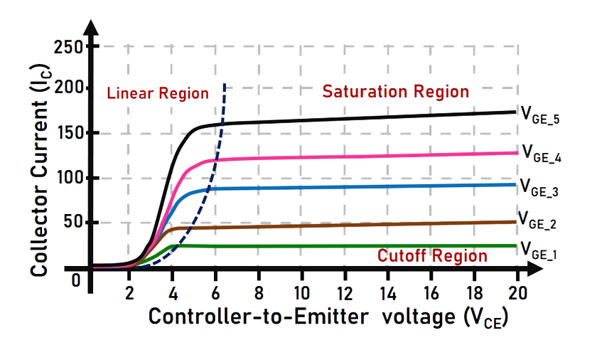
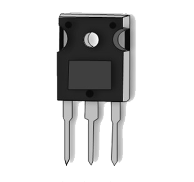

### Theory

### 1) SCR

**Representation of SCR:**

Fig. 1(a) and 1(b) show the symbolic representation of SCR and a typical SCR package available in market.

 

<table border="0" align="center" style="width:100%; border:none;">
  <tr>
<td style="width:50%">

 

  
Fig. 1(a). Symbolic representation of SCR.
  

</td>
<td style="width:50%">
  

 

  
Fig. 1(b). A typical SCR package.
  

 
    </td>
  </tr>
</table>
 

 

 
  
**Introduction to SCR:**

Fig. 2 shows the internal structure of a SCR. Some of the key features of SCR are compiled and given below.

 
Fig. 2. Internal structure of SCR.
 

 

1.	Silicon-controlled rectifier (SCR) is a semiconductor power device. It is used as a controlled switch in power electronic circuits as bistable switches (ON/ OFF State). In utility dc transmission line applications, series-connected SCRs are employed in It finds wide applications in AC-DC rectifiers, Choppers, AC Voltage controllers, Cycloconverters and Inverters. 

2.	It has a four layer PNPN structure: Two P-type doped (p) layers, Two N-type doped layers, one is heavy doped (n+) and lightly doped (n-). It has three junctions: p-n (J1), n-p (J2) and p-n+ (J3). 
3.	The  SCR has three external terminals namely: Anode (A), Cathode (K) and Gate (G).   

**Operating modes of SCR:**
 

1.	Forward Blocking State: When the anode voltage is made more positive with respect to the cathode and the Gate current is zero, the junctions ‘J1 ‘ and ‘J3 ‘ are forward biased while ‘J2 ‘ is reverse biased. Only a small leakage current flows from anode to cathode. The SCR is then said to be in the forward blocking.

2.	Forward Conducting State: If the anode-to-cathode voltage (vAK)  is increased to a sufficient value, the reverse-biased junction J2 breaks down. This is known as avalanche breakdown. All three junctions (J1, J2 and J3 ) are now forward biased, resulting in flow of current (iA). The device is now in conducting state, or ON-state. A minimum anode current known as ‘latching current’ (IL) needs to be maintained immediately after the SCR goes to ON- State.
  
3.	Once the SCR starts conducting, gate loses control over the device. It continues conducting even after gate signal is removed. However, if the forward anode current (IA) is reduced below a level known as the ‘holding current’ (IH), the SCR goes to blocking state. The holding current is less than the latching current.

4.	Reverse Blocking State:  When the cathode voltage is more positive with respect to the anode, the junctions 'J1' and 'J3' are reverse biased while junction 'J2 is forward biased. No current flows from anode-to-cathode and hence the SCR is in reverse blocking state or OFF- State.  

**'v-i' Characteristics of the SCR:**

1.	'v-i' characteristics of a SCR shows the variation between the anode current (iA) against the anode-to-cathode voltage (vAK).  
2.	The circuit diagram to plot the characteristics is given in Fig. 3. 

 
Fig. 3. Circuit to plot v-I characteristics.
 

  

3.	The 'v-i' characteristics of SCR is shown in Fig. 4.

 
Fig. 4. v-i  characteristics of SCR.
 

  

4.	SCR has three operating modes: Forward Blocking, Forward Conduction and Reverse Blocking as shown in Fig. 4. 'IH' is the holding current and 'IL' is the latching current. The Forward breakover voltages 'VBO1 , VBO2 and VBO3' (VBO1 <VBO2 <VBO3) correspond to the Gate currents 'Ig1, Ig2  and Ig3'  (Ig1 > Ig2 > Ig3) respectively.

 
  
**Circuit Diagram to plot 'v-i' Characteristics**

The v-i characteristics of SCR can be obtained using the circuit diagram given in Fig. 3. AC supply is connected in series with SCR and a resistive load. In order to obtain the v-i characteristics, the Anode-to-Cathode voltage (vAK) and Anode current (iA) are to be recorded using any one of the following methods:

1.	Using Analog measuring instruments: Voltmeters and Ammeters
2.	Using Digital Storage Oscilloscope

**•	Method-1: Using Analog measuring instruments: Voltmeters and Ammeters**

 
Fig. 5. Circuit Diagram using meters.
 

 

Steps for experimentation (Refer Fig. 5): 

  1.	Ammeter to measure the anode current and Voltmeter to measure the anode-to-cathode voltage (vAK) are to be connected in series and parallel respectively to the SCR.

  2.	The gate supply circuit consists of a battery in series with the  rheostat and an Ammeter. The rheostat (Rg) limits the gate current (Ig) magnitude since only a very small amount of gate current is required to trigger the SCR into ON-state.

  3.	The input supply voltage is increased in steps and the corresponding Voltmeter and Ammeter readings are to be tabulated. The data points indicate the v-i characteristics.  

**Instruments required for the above method:**

<table border="0" align="center" style="width:100%; border:none;">
  <tr>
<td style="width:50%">

  
**Instrument**

</td>
<td style="width:50%">
  

  
**Quantity**

 
    </td>
  </tr>

  <tr>
<td style="width:50%">

  
SCR mounted on a heat sink

</td>
<td style="width:50%">
   

  
**1**

 
    </td>
  </tr>

  <tr>
<td style="width:50%">

Variable AC supply (autotransformer)

</td>
<td style="width:50%">
  

  
**1**

 
    </td>
  </tr>

  <tr>
<td style="width:50%">

Rheostats (Rating: 1 KΩ, 100 KΩ)

</td>
<td style="width:50%">
  

  
**2**

 
    </td>
  </tr>
  
  <tr>
<td style="width:50%">

Multi-meter

</td>
<td style="width:50%">
  

  
**1**

 
    </td>
  </tr>
  
  <tr>
<td style="width:50%">

AC- Voltmeter

</td>
<td style="width:50%">
  

  
**1**

 
    </td>
  </tr>
  
  <tr>
<td style="width:50%">

AC-Ammeter

</td>
<td style="width:50%">
  

  
**1**

 
    </td>
  </tr>
  
  <tr>
<td style="width:50%">

DC-Ammeter

</td>
<td style="width:50%">
  

  
**1**

 
    </td>
  </tr>
</table>

**•	Method-2: Using Digital Oscilloscope (DSO)**

 
Fig. 6. Circuit Diagram using probes.
 

 

Steps for experimentation (Refer Fig. 6): 

  1.	A hall effect current probe is used to measure the anode current (iA) and a differential voltage probe (DVP) to is used to measure the anode-to-cathode voltage (vAK). 
  2.	Measure the anode current using the hall effect current probe (connect this probe to channel-2 of DSO which displays on y-axis). The voltage probe is connected across the SCR to measure the anode-to-cathode voltage (connect this probe to channel-1 of DSO which displays on x-axis). 
  3.	The gate supply circuit consists of a battery in series with a rheostat and a DC ammeter. The rheostat (Rg) limits the gate current (Ig) magnitude since only a very small amount of gate current is required to trigger the SCR into ON-state. 
  4.	Increase the input supply voltage (vin) gradually and observe the current-vs-voltage profile simultaneously on the DSO screen. This trace is the v-i characteristics of the SCR.<br 
  

**Instruments required for the above method:**

<table border="0" align="center" style="width:100%; border:none;">
  <tr>
<td style="width:50%">

  
**Instrument**

</td>
<td style="width:50%">
  

  
**Quantity**

 
    </td>
  </tr>

  <tr>
<td style="width:50%">

  
SCR mounted on a heat sink

</td>
<td style="width:50%">
  

  
**1**

 
    </td>
  </tr>

  <tr>
<td style="width:50%">

Variable AC supply (autotransformer)

</td>
<td style="width:50%">
  

  
**1**

 
    </td>
  </tr>

  <tr>
<td style="width:50%">

Rheostats (Rating: 1 KΩ, 100 KΩ)

</td>
<td style="width:50%">
  

  
**2**

 
    </td>
  </tr>
  
  <tr>
<td style="width:50%">

Multi-meter

</td>
<td style="width:50%">
  

  
**1**

 
    </td>
  </tr>
  
  <tr>
<td style="width:50%">

Digital Oscilloscope (DSO)

</td>
<td style="width:50%">
  

  
**1**

 
    </td>
  </tr>
  
  <tr>
<td style="width:50%">

Differential Voltage Probe

</td>
<td style="width:50%">
  

  
**1**

 
    </td>
  </tr>
  
  <tr>
<td style="width:50%">

Current Probe

</td>
<td style="width:50%">
  

  
**1**

 
    </td>
  </tr>
</table>

### 2) IGBT

**Representation of IGBT:**

Fig. 7(a) and 7(b) show the symbolic representation of IGBT and a typical IGBT package available in market.

 

<table border="0" align="center" style="width:100%; border:none;">
  <tr>
<td style="width:50%">

 

  
Fig. 7(a). Symbolic representation of IGBT.
  

</td>
<td style="width:50%">
  

 

  
Fig. 7(b). A typical IGBT package.
  

 
    </td>
  </tr>
</table>
 

 

 
  
**Introduction to IGBT:**

Fig. 8 shows the internal structure of an IGBT. Some of the key features of IGBT are compiled and given below.

 
Fig. 8. Internal structure of IGBT.
 

 

1.  Insulated-Gate Bipolar Transistor (IGBT) is a semiconductor power device. It combines the advantages of a BJT and a MOSFET. It has high input impedance, like MOSFET, and low on-state conduction losses, like BJT. However, it shows higher switching time especially during the turn-off transition. 

2.  It has a four PNPN layer structure: a) Two P-type doped (p) layers. b) Two N-type doped layers- one is heavy doped (n+) and the other is lightly doped (n-). It has three junctions: n+-p (J1), p-n- (J2) and n--p (J3). 
3.  The IGBT has three external terminals namely: Gate (G), Collector (C) and Emitter (E).  

**Operating modes of IGBT:**
 

1.  Forward Blocking State: An IGBT is a voltage controlled device. When the Collector voltage is made more positive with respect to the Emitter and the Gate current is zero, the Collector current is negligible.

2.  Forward Conducting State: When the Gate voltage is made more positive than the Emitter voltage, n carriers are drawn into the p-channel near the gate region; this results in a forward bias of the n-p and p-n junctions. Current freely flows from collector to emitter. 
During forward conduction, the IGBT will operate in any one of the following states, depending on the values of Collector-to-Emitter voltage (VCE) and the Gate voltage (VGE) values: Cut-off region, Active region or Saturation region.
  
3.  Reverse Blocking State:  When the Emitter voltage is higher with respect to the Collector voltage, no current can flow through the device even with gate current applied.  

**Characteristics of the IGBT:**

1.  Output Characteristics: It is the plot between the Collector-to-Emitter voltage (VCE) and the Collector current (IC) for a fixed Gate-to-Emitter voltage (VGE). The circuit diagram to plot the characteristics is given in Fig. 9. Voltage ‘VCE’ is measured by the voltmeter while the ammeter measures the current ‘IC’.  

 
Fig. 9. Circuit diagram for Output characteristics.
 

  

The output characteristics of IGBT is shown in Fig. 10.

 
Fig. 10. Output characteristics of IGBT.
 

  
IGBT has three operating regions: Cutoff region, Linear region and Saturation region as shown in Fig. 11.   

a)  In cutoff region, the Gate voltage is lower than the threshold (VT) and the IGBT doesn’t conduct. 
b)  In linear region, the Collector current IC varies in proportion to the Collector-to-Emitter voltage VCE. IGBT is operated in the linear region for switching actions. 
c)  In the saturation region, the Collector current remains almost constant for any increase in the value of VCE. 

 

### 3) MOSFET

**Representation of MOSFET:**

Fig. 12(a) and 12(b) show the symbolic representation of MOSFET and a typical MOSFET package available in market.

 

<table border="0" align="center" style="width:100%; border:none;">
  <tr>
<td style="width:50%">

 

  
Fig. 12(a). Symbolic representation of MOSFET
  

</td>
<td style="width:50%">
  

 

  
Fig. 12(b). A typical MOSFET package
  

 
    </td>
  </tr>
</table>
 

 

 
  
**Introduction to MOSFET:**

Fig. 13 shows the internal structure of MOSFET. Some of the key features of MOSFET are compiled and given below.

 
Fig. 13. Internal structure of MOSFET.
 

 

1.  It is a three-terminal majority carrier device. It exhibits high switching speed, low rise and fall time. It is suitable for low-power, high-frequency switching applications such as DC-DC converters. 

2.  It is a voltage-controlled device and the ‘Gate circuit’ requires only a small amount of current for it to start conducting (ON-State). 

3.  There are two types of MOSFETs: a) Depletion type, b) Enhancement type. Both have three terminals: Drain (D), Source (S) and Gate (G). 

4.  Enhancement-type MOSFET works in two modes: ON-state (conducting) and OFF-state (blocking), controlled by the PWM signal given to the Gate terminal. 

5.  For gate-to-source voltage more than threshold (VT), Enhancement-type MOSFET conducts. At zero gate voltage, it remains in OFF-state. Hence, it is generally used as switching device in power converters/ power conversion applications.     

**Operating modes of MOSFET switching device:**
 

1.  Forward Blocking State (vDS > 0, vGS = 0): A MOSFET is a voltage controlled device. When Drain-to-Source voltage (vDS) is positive, both the junctions remain reverse biased. MOSFET doesn’t conduct.

2.  Forward Conducting State (vDS > 0, vGS ≥ VT): When Drain-to-Source voltage (vDS) is positive, with Gate-to-Source voltage (vGS) more than threshold voltage, the MOSFET starts conducting and hence current flows from drain to source. 
During forward conduction, the MOSFET will operate in any one of the following states, depending on the values of drain-to-source voltage (VDS) and the Gate voltage (VGS) values: Cut-off region, linear region and Saturation region.
  
3.  Reverse Blocking State (vDS < 0):  When the drain-to-source voltage (VDS) is negative the junctions become reverse biased and MOSFET stops conducting.  

**Characteristics of the MOSFET:**

Output Characteristics: It is the plot between the Drain-to-Source voltage (VDS) and the Drain current (ID) for a fixed Gate-to-Source voltage (VGS). The circuit diagram to plot these characteristics is given in Fig. 14. Voltage ‘VDS’ is measured by the voltmeter while the ammeter measures the current ‘ID’.  

 
Fig. 14. Circuit diagram for output characteristics.
 

  

The output characteristics of MOSFET is shown in Fig. 14.

 
Fig. 15. Output characteristics of MOSFET.
 

  

MOSFET has three operating regions: Cutoff region, Linear region and Saturation region as shown in Fig. 15.
